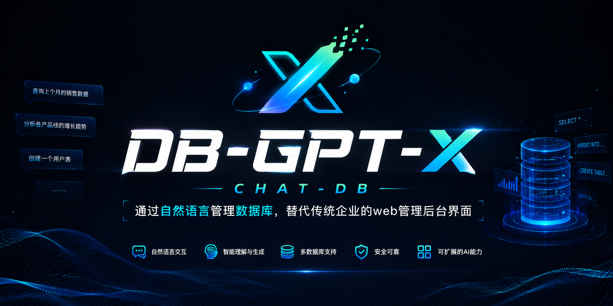

# DB-GPT-X

> Talk to your database in natural language — replace your enterprise web admin console.

<p align="center">
  
</p>

<div align="center">
  <a href="https://github.com/sql-agi/DB-GPT-X">
    
  </a>
  <a href="https://github.com/sql-agi/DB-GPT-X">
    
  </a>
  <a href="https://opensource.org/licenses/MIT">
    
  </a>
  <a href="https://github.com/sql-agi/DB-GPT-X/releases">
    
  </a>
  <a href="https://github.com/sql-agi/DB-GPT-X/issues">
    
  </a>
  <br/>
  👋 Join our <a href="img/WECHAT.md" target="_blank">WeChat</a>
</div>

---

## Table of Contents

- [Introduction](#introduction)
- [Quick Start](#quick-start)
  - [Docker Deploy](#docker-deploy)
  - [Web & CLI](#web--cli)
  - [API Deploy](#api-deploy)
- [Future Plans](#future-plans)
- [Contact Us](#contact-us)

---

## Introduction

🤖 DB-GPT-X is an open-source data application development framework that uses Large Language Model (LLM) technology to interact with databases through natural language, replacing traditional web management backends.

🌐 Currently we provide query access only. Support for full CRUD operations (Create, Read, Update, Delete) is under internal testing and will be released soon.

🚀 In the Data 3.0 era, DB-GPT-X enables enterprises and developers to build custom applications with less code — letting developers focus on complex business logic instead of managing admin consoles.

---

## Quick Start

```shell
git clone https://github.com/sql-agi/DB-GPT-X
```

### Docker Deploy

1. Configure the `.env` file (reference: `templates.env_temple`)
2. Set `OPENAI_API_KEY` and `OPENAI_API_BASE` (official API key recommended)
3. Switch to the docker directory:

```shell
cd DB-GPT-X/docker
```

4. Follow the instructions in `docker/README.md`

> **Note:** To customize the database schema or seed data, edit `/docker/sql/init.sql`.

### Web & CLI

**Prerequisites:** Python 3.9, Conda

```shell
conda create --name db-gpt python=3.9
conda activate db-gpt
pip install -r requirements.txt
```

Configure `.env` (reference: `templates.env_temple`):

| Variable | Required |
|---|---|
| `OPENAI_API_KEY` | ✅ |
| `OPENAI_API_BASE` | ✅ |
| `MYSQL_HOST` | ✅ |
| `MYSQL_PORT` | ✅ |
| `MYSQL_USER` | ✅ |
| `MYSQL_PASSWORD` | ✅ |
| `MYSQL_DATABASE` | ✅ |

> 🔥 We strongly recommend using the official OpenAI API key. Third-party relay keys may produce degraded results.

#### Web Demo


```shell
python web_demo.py
```

The program starts a local web server. Open the printed URL in your browser. The latest version features a typewriter effect for improved UX.

> By default `share=False`. Set `share=True` in [web_demo.py](web_demo.py) for public access via Gradio's relay server (note: this may reduce typewriter performance).

#### CLI Demo


```shell
python cli_demo.py
```

Interactive conversation in the terminal. Type `quit` to exit.

### API Deploy

```shell
python api.py
```

Starts a local server on port `8000`. Call via POST:

```shell
curl -X POST "http://127.0.0.1:8000/chat/db" \
     -H "Content-Type: application/json" \
     -d '{"input": "hello"}'
```

Response:

```json
{
    "reply": "Hello! How can I help you?"
}
```

---

## Future Plans

- **Frontend:** Richer UI, support for more database types and open-source LLMs
- **Backend:** Deep testing of complex CRUD scenarios, environment switching, role-based permissions
- **Community:** More user feedback integration; contributors welcome

---

## Contact Us

### WeChat Group


Join the DB-GPT-X WeChat community to discuss and share feedback.

### Official Account


Follow our official WeChat account for updates.

---

## Reference Projects

- [LangChain](https://github.com/langchain-ai/langchain)

---

## Project Statement

DB-GPT-X is an independently developed open-source project maintained by the sql-agi team.

This project has no affiliation, authorization, endorsement, or cooperative relationship with eosphoros-ai/DB-GPT.

The source code, architecture design, and core implementations of DB-GPT-X are independently developed and maintained by the sql-agi team.
